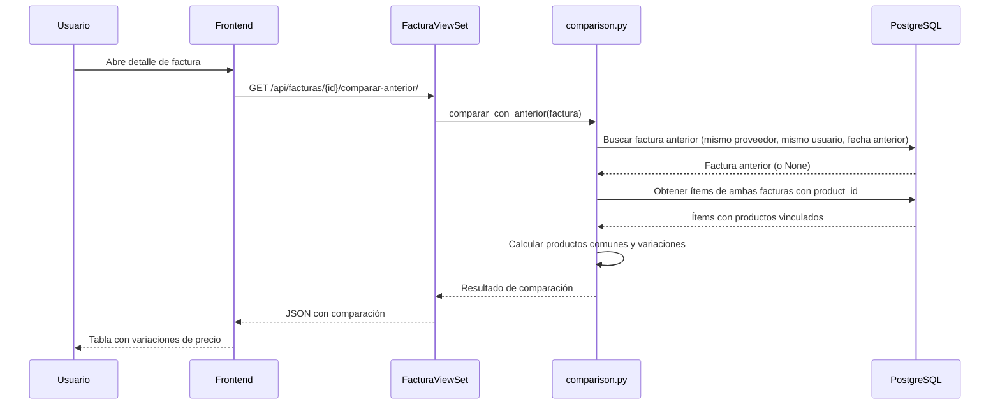
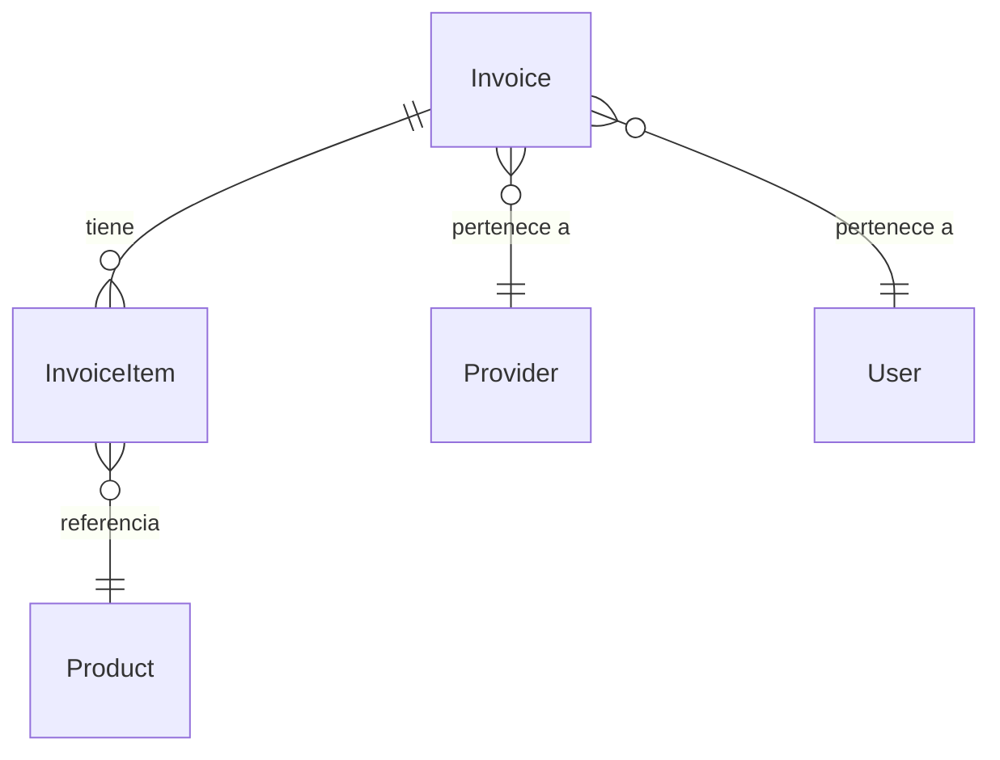

# Documento de Diseño — Comparación de Precios entre Facturas

## Visión General

Esta funcionalidad extiende el sistema existente de gestión de facturas para permitir la comparación automática y manual de precios de productos entre facturas del mismo proveedor. El sistema se integra con los modelos existentes (`Invoice`, `InvoiceItem`, `Product`, `Provider`) sin requerir nuevas tablas, aprovechando las relaciones ya establecidas entre facturas, ítems y productos.

### Decisiones de Diseño Clave

1. **Sin nuevos modelos de datos**: Las comparaciones se calculan en tiempo real a partir de los datos existentes en `InvoiceItem` y `Product`, evitando duplicación de datos y complejidad de sincronización.
2. **Lógica de comparación centralizada en un servicio**: Se crea un módulo `invoices/comparison.py` con funciones puras que encapsulan toda la lógica de comparación, facilitando testing y reutilización.
3. **Endpoints nuevos como acciones del ViewSet existente**: Los endpoints de comparación se agregan como `@action` en `FacturaViewSet`, manteniendo coherencia con la estructura de URLs actual.
4. **Matching de productos por FK**: Dos ítems de facturas distintas se consideran "Producto_Común" si ambos apuntan al mismo `Product` (mismo `product_id`). Esto es confiable porque el parser de IA ya vincula ítems a productos existentes.

## Arquitectura

```mermaid
graph TD
    subgraph Frontend [React + Vite]
        PC[PriceComparison.jsx]
        INV[Invoices.jsx - Detalle]
    end

    subgraph Backend [Django + DRF]
        FVS[FacturaViewSet]
        CS[comparison.py - Servicio]
        M[Models: Invoice, InvoiceItem, Product]
    end

    subgraph DB [PostgreSQL]
        IT[invoice_items]
        I[invoices]
        P[products]
    end

    PC -->|GET /api/facturas/{id}/comparar-anterior/| FVS
    PC -->|GET /api/facturas/comparar-manual/| FVS
    PC -->|GET /api/facturas/comparar-mes/| FVS
    INV -->|GET /api/facturas/{id}/ con variaciones| FVS
    FVS --> CS
    CS --> M
    M --> IT
    M --> I
    M --> P
```

### Flujo de Comparación Automática



## Componentes e Interfaces

### Backend

#### 1. Módulo de Servicio: `invoices/comparison.py`

Contiene funciones puras para la lógica de comparación:

```python
def obtener_factura_anterior(factura: Invoice) -> Optional[Invoice]:
    """Encuentra la factura completada más reciente del mismo proveedor y usuario."""

def calcular_comparacion(factura_actual: Invoice, factura_base: Invoice) -> dict:
    """Calcula la comparación de productos comunes entre dos facturas.
    Retorna dict con metadatos de ambas facturas y lista de productos comunes
    con precios y variaciones."""

def calcular_variacion(precio_anterior: Decimal, precio_actual: Decimal) -> dict:
    """Calcula diferencia absoluta y porcentual entre dos precios.
    Retorna dict con diferencia, variacion_porcentual."""

def comparar_mes(proveedor_id: int, user, year: int, month: int) -> dict:
    """Calcula resumen mensual de precios para un proveedor.
    Retorna dict con lista de facturas del período y estadísticas por producto."""

```

#### 2. Endpoints API (acciones en `FacturaViewSet`)

| Endpoint | Método | Descripción | Parámetros |
|---|---|---|---|
| `/api/facturas/{id}/comparar-anterior/` | GET | Comparación automática con factura anterior | — |
| `/api/facturas/comparar-manual/` | GET | Comparación entre dos facturas específicas | `factura_base`, `factura_comparar` |
| `/api/facturas/comparar-mes/` | GET | Resumen mensual por proveedor | `proveedor_id`, `year` (opc), `month` (opc) |

#### 3. Serializers: `invoices/comparison_serializers.py`

```python
class ProductoComparacionSerializer:
    """Serializa un producto común con sus precios y variación."""
    # producto_nombre, precio_anterior, precio_actual, diferencia, variacion_porcentual

class ComparacionAutomaticaSerializer:
    """Serializa la respuesta de comparación automática."""
    # factura_actual (metadatos), factura_anterior (metadatos), productos_comunes[]

class ComparacionMensualProductoSerializer:
    """Serializa estadísticas de un producto en el período."""
    # producto_nombre, precio_minimo, precio_maximo, precio_promedio, variacion_porcentual

class ComparacionMensualSerializer:
    """Serializa la respuesta de comparación mensual."""
    # proveedor, periodo, facturas[], productos[]
```

### Frontend

#### 1. Página `PriceComparison.jsx` (refactorizada)

Se reestructura la página existente para incluir tres secciones con tabs:

- **Comparación Automática**: Selector de factura → muestra comparación con factura anterior
- **Comparación Manual**: Selector de proveedor → dos selectores de factura → botón "Comparar"
- **Resumen Mensual**: Selector de proveedor + selector de mes/año → tabla resumen

#### 2. Componentes compartidos

```
frontend/src/components/
  PriceVariationBadge.jsx    # Badge con flecha ↑↓ y color rojo/verde/gris
  ComparisonTable.jsx         # Tabla reutilizable de productos comunes
```

#### 3. Modificación en `Invoices.jsx`

En el modal de detalle de factura, se agrega una columna de variación de precio por ítem cuando existe factura anterior. Se usa el endpoint de detalle existente enriquecido con datos de variación.

### Formato de Respuesta API

#### Comparación Automática / Manual

```json
{
  "factura_actual": {
    "id": 5,
    "numero": "001-456",
    "fecha_emision": "2024-03-15",
    "proveedor": "Sodimac"
  },
  "factura_anterior": {
    "id": 3,
    "numero": "001-123",
    "fecha_emision": "2024-02-10",
    "proveedor": "Sodimac"
  },
  "productos_comunes": [
    {
      "producto_id": 12,
      "producto_nombre": "Cable THHN 2.5mm",
      "precio_anterior": 15000,
      "precio_actual": 16500,
      "diferencia": 1500,
      "variacion_porcentual": 10.0
    }
  ],
  "mensaje": null
}
```

#### Comparación Mensual

```json
{
  "proveedor": "Sodimac",
  "periodo": { "year": 2024, "month": 3 },
  "facturas": [
    { "id": 3, "numero": "001-123", "fecha_emision": "2024-03-01" },
    { "id": 5, "numero": "001-456", "fecha_emision": "2024-03-15" }
  ],
  "productos": [
    {
      "producto_id": 12,
      "producto_nombre": "Cable THHN 2.5mm",
      "precio_minimo": 14500,
      "precio_maximo": 16500,
      "precio_promedio": 15500,
      "variacion_porcentual": 13.79
    }
  ],
  "mensaje": null
}
```

## Modelos de Datos

### Modelos Existentes (sin cambios)

No se requieren nuevos modelos ni migraciones. La comparación se basa en:

- **`Invoice`**: Campos usados: `id`, `user`, `provider`, `invoice_number`, `issue_date`, `status`
- **`InvoiceItem`**: Campos usados: `invoice`, `product` (FK a Product), `unit_price`, `description`
- **`Product`**: Campos usados: `id`, `name`

### Relación Clave para Comparación



Dos `InvoiceItem` de facturas distintas son "Producto_Común" cuando:
- `item_a.product_id == item_b.product_id`
- `item_a.product_id IS NOT NULL`
- `item_a.invoice.provider_id == item_b.invoice.provider_id`

### Queries Principales

**Factura anterior:**
```sql
SELECT * FROM invoices_invoice
WHERE provider_id = :provider_id
  AND user_id = :user_id
  AND status = 'completed'
  AND issue_date < :current_date
ORDER BY issue_date DESC
LIMIT 1;
```

**Productos comunes entre dos facturas:**
```sql
SELECT
  p.id, p.name,
  i1.unit_price AS precio_anterior,
  i2.unit_price AS precio_actual
FROM invoices_invoiceitem i1
JOIN invoices_invoiceitem i2 ON i1.product_id = i2.product_id
JOIN products_product p ON p.id = i1.product_id
WHERE i1.invoice_id = :factura_anterior_id
  AND i2.invoice_id = :factura_actual_id
  AND i1.product_id IS NOT NULL;
```


## Propiedades de Correctitud

*Una propiedad es una característica o comportamiento que debe mantenerse verdadero en todas las ejecuciones válidas de un sistema — esencialmente, una declaración formal sobre lo que el sistema debe hacer. Las propiedades sirven como puente entre especificaciones legibles por humanos y garantías de correctitud verificables por máquinas.*

### Propiedad 1: Selección correcta de factura anterior

*Para cualquier* conjunto de facturas de un usuario y proveedor, `obtener_factura_anterior(factura)` debe retornar la factura completada con la fecha de emisión más reciente que sea estrictamente anterior a la fecha de la factura actual, del mismo proveedor y mismo usuario. Si no existe tal factura, debe retornar `None`.

**Valida: Requisitos 1.1, 1.4**

### Propiedad 2: Identificación de productos comunes

*Para cualquier* par de facturas del mismo proveedor, el conjunto de productos comunes retornado por `calcular_comparacion` debe ser exactamente la intersección de los `product_id` (no nulos) de los ítems de ambas facturas. Si la intersección es vacía, la lista de productos comunes debe estar vacía.

**Valida: Requisitos 1.2, 1.5**

### Propiedad 3: Cálculo de variación de precio

*Para cualquier* par de precios unitarios positivos (precio_anterior, precio_actual), `calcular_variacion` debe retornar una diferencia absoluta igual a `precio_actual - precio_anterior` y una variación porcentual igual a `((precio_actual - precio_anterior) / precio_anterior) * 100`.

**Valida: Requisito 1.3**

### Propiedad 4: Completitud de respuesta de comparación

*Para cualquier* comparación entre dos facturas con productos comunes, la respuesta debe incluir: (a) metadatos de ambas facturas (id, número, fecha de emisión, proveedor) y (b) para cada producto común: nombre del producto, precio anterior, precio actual, diferencia absoluta y variación porcentual.

**Valida: Requisitos 2.2, 2.3**

### Propiedad 5: Control de acceso a comparaciones

*Para cualquier* usuario y factura, el endpoint de comparación debe retornar datos solo si el usuario es propietario de la factura o es usuario staff. En caso contrario, debe retornar 404.

**Valida: Requisito 2.4**

### Propiedad 6: Validación de mismo proveedor en comparación manual

*Para cualquier* par de facturas que pertenezcan a proveedores distintos, el endpoint de comparación manual debe retornar un error 400 con el mensaje "Las facturas deben pertenecer al mismo proveedor".

**Valida: Requisito 3.3**

### Propiedad 7: Validación de estado completado en comparación manual

*Para cualquier* par de facturas donde al menos una no tenga estado "completed", el endpoint de comparación manual debe retornar un error 400 con el mensaje "Ambas facturas deben estar completadas".

**Valida: Requisito 3.5**

### Propiedad 8: Correctitud de agregación mensual

*Para cualquier* conjunto de facturas completadas de un proveedor dentro de un período mensual, `comparar_mes` debe retornar: (a) la lista completa de facturas del período con fecha y número, y (b) para cada producto que aparece en al menos dos facturas: precio mínimo, precio máximo y precio promedio correctos, y la variación porcentual calculada entre la primera y última factura del período ordenadas por fecha.

**Valida: Requisitos 4.3, 4.4**

### Propiedad 9: Visualización de badge de variación

*Para cualquier* valor de variación porcentual, el componente `PriceVariationBadge` debe renderizar: color rojo con flecha hacia arriba si la variación es positiva, color verde con flecha hacia abajo si es negativa, y color gris con texto "Sin cambio" si es cero.

**Valida: Requisitos 5.3, 5.4, 5.5**

### Propiedad 10: Enriquecimiento del detalle de factura con variaciones

*Para cualquier* factura que tenga una factura anterior del mismo proveedor, el endpoint de detalle (`/api/facturas/{id}/`) debe incluir datos de variación de precio para cada ítem que tenga un producto equivalente en la factura anterior, y la etiqueta "nuevo" para ítems sin equivalente.

**Valida: Requisitos 8.1, 8.2, 8.3**

## Manejo de Errores

### Backend

| Escenario | Código HTTP | Respuesta |
|---|---|---|
| Factura no existe o no pertenece al usuario | 404 | `{"detail": "No encontrado."}` |
| Facturas de proveedores distintos (comparación manual) | 400 | `{"error": "Las facturas deben pertenecer al mismo proveedor"}` |
| Factura no completada (comparación manual) | 400 | `{"error": "Ambas facturas deben estar completadas"}` |
| Proveedor no existe (comparación mensual) | 404 | `{"detail": "No encontrado."}` |
| Sin factura anterior | 200 | `{"factura_actual": {...}, "factura_anterior": null, "productos_comunes": [], "mensaje": "No existe factura anterior para este proveedor"}` |
| Sin productos comunes | 200 | `{"factura_actual": {...}, "factura_anterior": {...}, "productos_comunes": [], "mensaje": "No hay productos en común entre las facturas"}` |
| Sin facturas en período | 200 | `{"proveedor": "...", "periodo": {...}, "facturas": [], "productos": [], "mensaje": "No hay facturas de este proveedor en el período indicado"}` |
| Parámetros faltantes (comparación manual) | 400 | `{"error": "Se requieren los parámetros factura_base y factura_comparar"}` |
| Proveedor no especificado (comparación mensual) | 400 | `{"error": "Se requiere el parámetro proveedor_id"}` |
| Precio anterior es cero (división por cero) | — | `variacion_porcentual` se retorna como `null`, diferencia se calcula normalmente |

### Frontend

- Errores de red: Toast de error genérico con opción de reintentar
- Errores 400: Mostrar mensaje de error del backend en un alert inline
- Errores 404: Redirigir o mostrar "Factura no encontrada"
- Loading states: Skeleton/spinner en cada sección mientras se cargan datos

## Estrategia de Testing

### Tests Unitarios (Backend - pytest)

- `invoices/comparison.py`: Tests de cada función pura con ejemplos concretos
  - `obtener_factura_anterior`: Casos con 0, 1, N facturas anteriores
  - `calcular_comparacion`: Casos con 0, 1, N productos comunes
  - `calcular_variacion`: Subida, bajada, sin cambio, precio anterior cero
  - `comparar_mes`: Período vacío, 1 factura, N facturas

### Tests de Propiedades (Backend - pytest + Hypothesis)

Se usará la librería **Hypothesis** para property-based testing en Python.

- Cada propiedad del documento se implementa como un test con `@given` de Hypothesis
- Mínimo 100 iteraciones por propiedad (`settings(max_examples=100)`)
- Cada test incluye un comentario referenciando la propiedad del diseño:
  - Formato: `# Feature: invoice-price-comparison, Property {N}: {título}`
- Las propiedades 1-8 se testean contra las funciones puras de `comparison.py`
- La propiedad 9 (badge de variación) se testea con tests unitarios de React (ejemplo-based) dado que el frontend no tiene Hypothesis equivalente configurado; alternativamente se puede usar `fast-check` si se agrega como dependencia

### Tests de Integración (Backend - pytest-django)

- Endpoints API con `APIClient`:
  - Verificar autenticación y permisos
  - Verificar respuestas correctas con datos reales en DB
  - Verificar errores 400/404 con datos inválidos

### Tests Frontend (Ejemplo-based)

- Componentes React con datos mock:
  - `PriceVariationBadge`: Renderiza correctamente para valores positivos, negativos y cero
  - `ComparisonTable`: Muestra columnas correctas
  - `PriceComparison.jsx`: Tabs funcionan, selectores cargan datos
  - `Invoices.jsx`: Modal de detalle muestra variaciones cuando existen

### Configuración de Hypothesis

```python
# conftest.py o settings de Hypothesis
from hypothesis import settings
settings.register_profile("ci", max_examples=200)
settings.register_profile("dev", max_examples=100)
settings.load_profile("dev")
```
